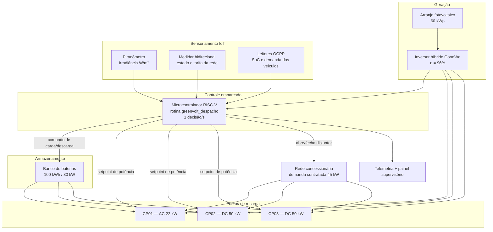
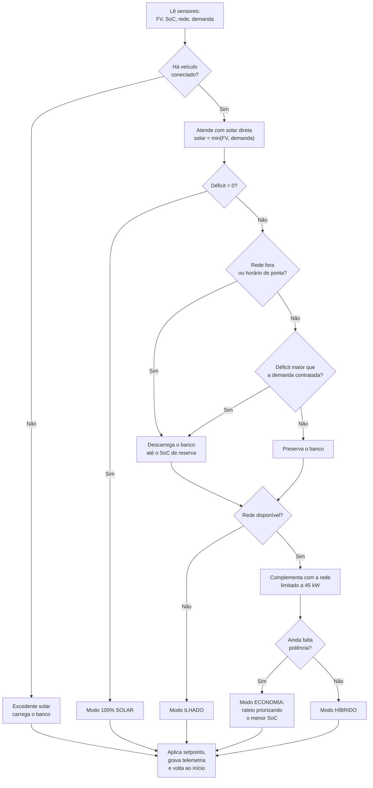
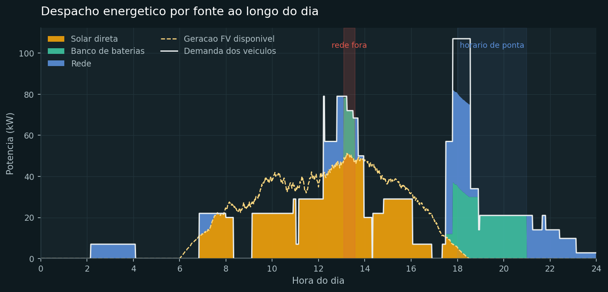
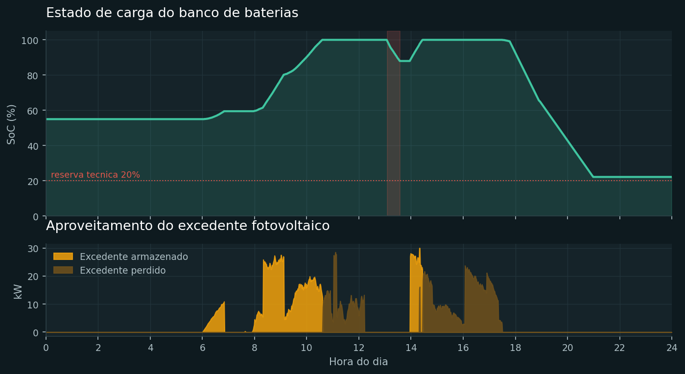
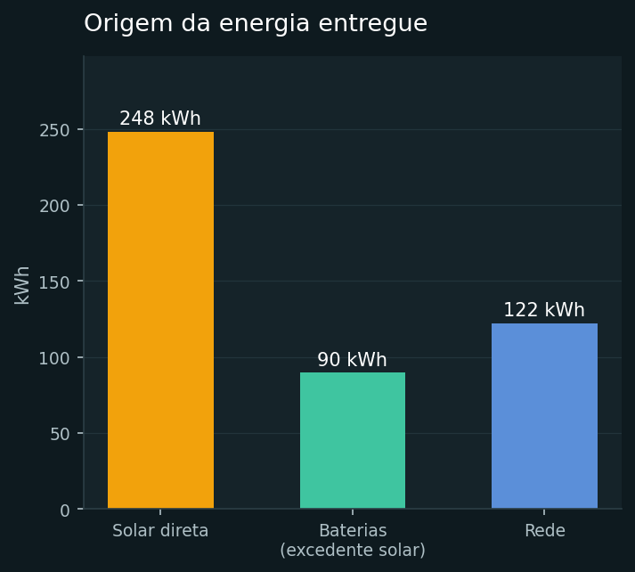

# GreenVolt — Protótipo Funcional de Gerenciamento Energético para Eletropostos Sustentáveis

**Sprint 3 — Prototipagem Funcional e Integração**

## Equipe

| Integrante | RM |
|---|---|
| João Victor Canello Ferian | RM573295 |
| Gustavo Melo dos Santos | RM573562 |
| João Pedro Costenari Silva | RM572260 |

**Vídeo técnico da Sprint 3:** _(inserir link do YouTube)_
**Sprint 1 (proposta):** https://github.com/Melirous/1CCPO-Equipe2-S1-SERS
**Sprint 2 (arquitetura):** https://github.com/Melirous/1CCPO-Equipe02-S2-SERS

---

## 1. O que existe de novo nesta Sprint

Nas Sprints 1 e 2 o GreenVolt era uma proposta: um eletroposto que prioriza energia solar e usa um controlador RISC-V eficiente. O código da Sprint 2 era um trecho de decisão com três variáveis fixas.

A Sprint 3 entrega o sistema **operando**. O protótipo é uma planta simulada completa — sensores, banco de baterias, três pontos de recarga e a rede da concessionária — comandada por um controlador que toma uma decisão por minuto durante 24 horas e registra tudo que fez.

O que passou a existir:

- **Camada de sensoriamento** que produz irradiância, tarifa, estado da rede e chegada de veículos (`src/sensores.py`).
- **Controlador de despacho** com quatro níveis de prioridade, banco de baterias e rateio de potência entre os pontos (`src/controlador.py`).
- **A mesma lógica em Assembly RISC-V**, pronta para o microcontrolador do quadro de comando (`firmware/decisao_riscv.s`).
- **Dados funcionais reais da execução**: 1.440 registros de telemetria, 16 sessões de recarga e 22 comandos automáticos (`dados/`).
- **Painel supervisório** com os gráficos da operação (`docs/dashboard.html`).
- **Testes que provam cada regra de despacho** (`src/teste_integracao.py`).

---

## 2. Esquema de integração dos componentes

### 2.1 Diagrama de blocos



### 2.2 Fluxograma do ciclo de decisão



### 2.3 Como os arquivos se conectam

```
sensores.py  ──(telemetria)──▶  controlador.py  ──(setpoints)──▶  simulador.py
                                       │                                │
                            firmware/decisao_riscv.s                 dados/*.csv
                            (mesma lógica, embarcada)                    │
                                                                  dashboard.py
                                                                         │
                                                              docs/dashboard.html
```

O `simulador.py` é o laço de tempo real: a cada minuto ele lê os sensores, chama o controlador, aplica a potência nos veículos e grava a linha de telemetria. O `dashboard.py` só consome o que foi gravado — nenhum número do painel é digitado à mão.

---

## 3. Justificativa técnica das escolhas

| Componente | Escolha | Por que |
|---|---|---|
| Geração | Arranjo de 60 kWp | Dimensionado para cobrir o pico de demanda diurno (≈50 kW) da planta simulada sem superdimensionar o investimento. |
| Inversor | Híbrido GoodWe (η 96%) | Inversor híbrido gerencia FV, baterias e rede no mesmo equipamento, o que elimina um estágio de conversão e a perda associada. Já era a escolha da Sprint 1. |
| Armazenamento | 100 kWh / 30 kW | 100 kWh absorve o excedente do meio-dia e sustenta as três horas de ponta; 30 kW é suficiente para segurar um DC de 50 kW junto com a geração residual. |
| Controle | Microcontrolador RISC-V | ISA aberta, sem royalties, e conjunto de instruções reduzido. A rotina de despacho cabe em aritmética inteira de 32 bits, sem FPU — o próprio sistema de controle consome pouca energia, o que é coerente com a proposta. |
| Lógica embarcada | Assembly (RV32IM) | Permite estimar o custo do ciclo de decisão em número de instruções e garantir tempo de execução determinístico, exigência de um laço de controle que atua sobre potência. |
| Protótipo | Simulação em Python | Reproduz 24 horas de operação em segundos, com seed fixa, o que torna a demonstração auditável e repetível. Python também torna a lógica legível para comparação direta com o Assembly. |
| Comunicação com os pontos | OCPP | Protocolo aberto padrão do setor; permite comandar o setpoint de potência de cada ponto, que é o que viabiliza o modo economia. |
| Passo de simulação | 1 minuto | Resolução suficiente para capturar a passagem de nuvens e as transições de modo sem gerar arquivos inviáveis de auditar. |

### Decisões de projeto que valem destaque

**Por que a bateria não entra sempre.** Descarregar o banco fora de ponta desperdiçaria ciclos de vida útil para economizar a tarifa mais barata. O controlador só aciona o banco quando a rede caiu, quando estamos em ponta, ou quando o déficit ultrapassaria a demanda contratada. Isso preserva o banco para os momentos em que ele realmente vale mais.

**Por que existe reserva de 20% (e 10% no ilhamento).** Manter um piso de SoC prolonga a vida da bateria. O piso cai para 10% quando a rede está fora, porque nesse cenário a prioridade passa a ser não interromper a recarga.

**Por que o rateio prioriza o menor SoC.** No modo economia a potência é escassa. Servir primeiro o veículo mais descarregado maximiza a quantidade de carros que conseguem sair com autonomia útil.

---

## 4. Como executar

```bash
git clone https://github.com/Melirous/1CCPO-Equipe02-S3-SERS.git
cd 1CCPO-Equipe02-S3-SERS

python3 src/teste_integracao.py   # valida as regras de despacho
python3 src/simulador.py          # roda 24 h e grava dados/
python3 src/dashboard.py          # gera gráficos e docs/dashboard.html
```

Requisitos: Python 3.10+. O simulador e os testes usam só a biblioteca padrão; o painel usa `matplotlib` (`pip install -r requirements.txt`).

Montagem do firmware, para conferir que a rotina compila para RISC-V:

```bash
riscv32-unknown-elf-as -march=rv32im firmware/decisao_riscv.s -o decisao.o
```

---

## 5. Resultados e dados funcionais

Todos os números abaixo saíram da execução registrada em `dados/` — ciclo de 24 horas, seed 42.

### 5.1 Indicadores do dia

| Indicador | Valor |
|---|---|
| Energia entregue aos veículos | **459,83 kWh** |
| — fotovoltaica direta | 248,01 kWh |
| — banco de baterias (excedente solar armazenado) | 89,79 kWh |
| — rede concessionária | 122,04 kWh |
| **Participação renovável** | **73,5%** |
| Geração fotovoltaica total | 365,74 kWh |
| Excedente armazenado no banco | 60,61 kWh |
| Excedente não aproveitado (banco cheio) | 57,11 kWh |
| Sessões de recarga concluídas | 16 |
| Energia média por sessão | 28,57 kWh |
| Duração média por sessão | 120 min |
| Custo de energia com o GreenVolt | R$ 104,98 |
| Custo se toda a energia viesse da rede | R$ 394,41 |
| **Economia no dia** | **R$ 289,43 (73,4%)** |
| CO₂ evitado | 13,01 kg |
| Minutos sem consumir da rede | 521 |
| Minutos em modo economia | 46 |
| Minutos em modo ilhado | 30 |

> O CO₂ evitado usa o fator médio do Sistema Interligado Nacional adotado no projeto (0,0385 kgCO₂/kWh), parametrizado em `src/simulador.py`. A matriz brasileira já é predominantemente renovável, por isso o ganho ambiental por kWh é modesto — o ganho forte aqui é econômico e de alívio da rede.

### 5.2 Despacho por fonte ao longo do dia



A área amarela é a carga atendida direto pelo sol. A faixa vermelha às 13h05 é a interrupção de rede: o azul (rede) desaparece e o verde (banco) assume sozinho, sem que nenhuma sessão de recarga seja interrompida. Entre 18h e 21h, faixa de ponta, o controlador troca a rede pelo banco.

### 5.3 Banco de baterias e aproveitamento do excedente



O banco sai de 55%, enche com o excedente do meio-dia, sustenta o ilhamento e a ponta, e termina o dia em 22,2% — logo acima da reserva técnica. O gráfico inferior mostra o limite atual do protótipo: das 13h às 17h o banco está cheio e 57,11 kWh de sol são perdidos. É a justificativa quantitativa para ampliar o armazenamento ou habilitar injeção na rede numa próxima iteração.

### 5.4 Composição da energia entregue



### 5.5 Comandos automáticos registrados

Trecho de `dados/eventos_automacao.csv` — cada linha é uma reconfiguração da planta decidida pelo controlador, sem intervenção humana:

| Hora | Modo | Ação executada | FV (kW) | SoC (%) |
|---|---|---|---|---|
| 09:08 | 100% SOLAR | Chaveia carga para 100% fotovoltaico; rede em standby | 27,54 | 80,2 |
| 12:13 | HÍBRIDO | Complementa a geração solar com energia da rede | 41,18 | 100,0 |
| 13:05 | ILHADO | Abre o disjuntor de rede e opera pelo banco de baterias | 47,60 | 99,5 |
| 13:35 | HÍBRIDO | Rede restabelecida; complementa a geração solar com a rede | 47,03 | 88,0 |
| 17:48 | ECONOMIA | Limita potência dos pontos e prioriza veículo de menor SoC | 6,82 | 98,6 |
| 18:55 | SOLAR+BANCO | Sem geração solar: atende a demanda pelo banco de baterias | 0,00 | 65,4 |
| 21:00 | HÍBRIDO | Fim da ponta: retoma a rede e poupa o banco | 0,00 | 22,2 |

O ciclo completo tem **22 transições de modo** em 24 horas.

### 5.6 Sessões de recarga

Trecho de `dados/sessoes_recarga.csv`:

| Ponto | Veículo | Entrada | Saída | Min | SoC | kWh |
|---|---|---|---|---|---|---|
| CP01 | Renault Kwid E-Tech #01 | 02:10 | 04:05 | 115 | 29,7 → 80,0 | 13,48 |
| CP01 | Volvo EX30 #02 | 06:51 | 08:19 | 88 | 43,7 → 90,0 | 31,92 |
| CP01 | Toyota bZ4X #03 | 09:08 | 11:01 | 113 | 21,6 → 80,0 | 41,72 |
| CP03 | Volvo EX30 #06 | 12:13 | 13:07 | 54 | 14,7 → 80,0 | 45,08 |
| CP03 | Toyota bZ4X #08 | 13:01 | 14:18 | 77 | 22,0 → 90,0 | 48,55 |

A sessão do CP03 iniciada às 13h01 atravessa a queda de rede das 13h05 e termina normalmente: é a prova de que o ilhamento funciona do ponto de vista do usuário.

### 5.7 Validação das regras

Saída de `python3 src/teste_integracao.py`:

```
[OK] Sol cobre toda a demanda -> nao aciona a rede
[OK] Sol insuficiente fora de ponta -> complementa com a rede
[OK] Horario de ponta -> bateria assume o complemento
[OK] Queda de rede -> opera ilhado pelo banco
[OK] Demanda acima do contrato e banco na reserva -> modo economia
[OK] Sem veiculos -> excedente solar carrega o banco
[OK] Rede nunca ultrapassa a demanda contratada (45.0 kW <= 45.0 kW)
[OK] Balanco de potencia fecha (rateio 49.00 kW = entregue 49.00 kW)
8/8 verificacoes aprovadas
```

### 5.8 Painel supervisório

`docs/dashboard.html` reúne indicadores, gráficos, log de comandos e sessões em um arquivo único, que abre direto no navegador.

---

## 6. Como cada tecnologia contribui

**Sustentabilidade.** 73,5% da energia entregue veio do sol — direta ou armazenada. Sem o banco de baterias, 60,61 kWh de excedente teriam sido perdidos e a participação renovável cairia para 53,9%. O armazenamento é o que transforma geração em aproveitamento.

**Automação inteligente.** As 22 transições de modo aconteceram sem operador. O caso mais claro é a queda de rede às 13h05: o sistema detectou a falha, abriu o disjuntor, rebaixou o piso de SoC de 20% para 10% e manteve as duas recargas em andamento por 30 minutos.

**Eficiência energética.** Duas camadas. Na planta, o despacho por prioridade reduziu a conta em 73,4% e manteve a potência da rede sempre dentro dos 45 kW contratados, evitando multa por ultrapassagem de demanda. No controle, a decisão roda em aritmética inteira num RISC-V sem FPU — o sistema que gerencia a energia gasta pouca energia.

---

## 7. Conexão com os conteúdos da disciplina

| Conteúdo | Onde aparece no projeto |
|---|---|
| Arquitetura de computadores e ISA RISC-V | `firmware/decisao_riscv.s`: rotina `greenvolt_despacho` em RV32IM, com uso da convenção de chamada (argumentos em `a0`–`a5`, salvamento de `s0`–`s3` na pilha). |
| Programação em Assembly | Desvios condicionais (`blt`, `ble`, `beqz`), acesso à memória (`lw`/`sw`), cálculo de endereço por deslocamento (`slli` + `add`) no laço `rateia_potencia`. |
| Representação de dados e aritmética inteira | Potência em watts e SoC em por mil, escolhidos para eliminar ponto flutuante do laço de controle. |
| Sistemas embarcados e tempo real | Laço de controle determinístico, telemetria por amostragem periódica e saída por struct em memória mapeada. |
| Sensores e IoT | `src/sensores.py`: modelagem de piranômetro, medidor bidirecional e leitores OCPP como fontes de telemetria. |
| Lógica de programação e estruturas de dados | Máquina de decisão, fila de veículos, rateio ordenado por prioridade em `src/controlador.py`. |
| Energias renováveis e sustentabilidade | Curva de geração fotovoltaica com perda térmica, priorização de fonte renovável e cálculo de CO₂ evitado. |
| Análise de dados | Consolidação da telemetria em indicadores e visualizações (`src/dashboard.py`). |

---

## 8. Estrutura do repositório

```
.
├── README.md
├── requirements.txt
├── roteiro_video.md              # roteiro da demonstração de 5 min
├── src/
│   ├── sensores.py               # camada de sensoriamento IoT
│   ├── controlador.py            # máquina de decisão e banco de baterias
│   ├── simulador.py              # laço de operação de 24 h
│   ├── dashboard.py              # gráficos e painel supervisório
│   └── teste_integracao.py       # validação das regras de despacho
├── firmware/
│   └── decisao_riscv.s           # rotina de despacho em Assembly RV32IM
├── dados/
│   ├── telemetria_24h.csv        # 1.440 registros, 1 por minuto
│   ├── sessoes_recarga.csv       # 16 sessões concluídas
│   ├── eventos_automacao.csv     # 22 comandos automáticos
│   └── resumo_diario.json        # indicadores consolidados
└── docs/
    ├── dashboard.html            # painel supervisório
    ├── grafico_despacho.png
    ├── grafico_bateria.png
    └── grafico_fontes.png
```

---

## 9. Limitações e próximos passos

- **57,11 kWh de sol perdidos** com o banco cheio. Ampliar o armazenamento ou habilitar injeção na rede resolveria.
- **46 minutos em modo economia** no pico das 18h. Um sistema de reserva de horário reduziria a concorrência pelos pontos.
- A planta é simulada. O próximo passo natural é substituir `sensores.py` por leituras reais de um ESP32 com sensor de corrente e um piranômetro, mantendo o controlador intacto — a interface entre as camadas já foi desenhada para isso.
- A rotina em Assembly ainda não foi executada em hardware; a validação atual é a equivalência lógica com o controlador em Python.
